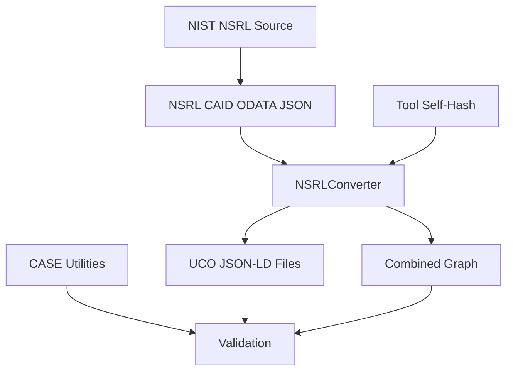

# Application Flow Document: NSRL-to-UCO Converter

## Data Flow Overview



## Process Flow

### 1. Initialization
1. Load and validate input files
2. Calculate tool self-hashes
3. Generate deterministic tool UUID
4. Initialize context and configuration
5. Set up logging (console and optional file)
6. Initialize UTC timezone for timestamps

### 2. Data Processing Flow
1. Input Processing
   - Read NSRL CAID JSON file
   - Parse ODATA structure
   - Validate input format

2. Conversion Process
   - Create UCO Bundle
   - Process Media Objects
   - Generate File Objects with UTC timestamps
   - Create Relationships
   - Add Provenance Information

3. Output Generation
   - Write individual UCO files
   - Create combined graph if requested
   - Validate output using CASE Utilities
   - Track processing statistics

## Component Interaction

### Tool Components
1. NSRLConverter Class
   - Main conversion logic
   - Hash calculation
   - Object creation with UTC timestamps
   - Relationship management
   - Progress tracking
   - Statistics collection

2. File Processing
   - Input file handling
   - Output file management
   - Batch processing
   - UTC timestamp generation

3. Output Management
   - Individual file generation
   - Combined graph creation
   - CASE validation
   - UCO compliance checking

## Error Handling Flow

1. Input Validation Errors
   - File not found
   - Invalid JSON format
   - Missing required fields
   Recovery Steps:
   - Log error details and location
   - Skip invalid file in batch mode
   - Continue with next file if available
   - Report specific validation failures

2. Processing Errors
   - Memory constraints
   - Data conversion issues
   - ID collisions
   - Invalid timestamps
   Recovery Steps:
   - For memory issues: Switch to chunk-based processing
   - For ID collisions: Generate new UUID
   - For invalid timestamps: Use current UTC time
   - Log warning if data is partially processed
   - Maintain partial output if possible

3. Output Errors
   - File write permissions
   - Disk space issues
   - Schema validation failures
   - CASE validation errors
   Recovery Steps:
   - Attempt alternate output location
   - Clean up temporary files
   - Report validation errors
   - Log specific CASE violations

## Validation Workflow

1. Input Validation
   ```mermaid
   graph TD
       A[Read Input File] --> B{Valid JSON?}
       B -->|Yes| C{Has Required Fields?}
       B -->|No| D[Log Error]
       C -->|Yes| E{Valid ODATA Format?}
       C -->|No| F[Log Missing Fields]
       E -->|Yes| G[Process File]
       E -->|No| H[Log Format Error]
   ```

2. Processing Validation
   - Check hash format validity
   - Verify category mappings
   - Validate relationship consistency
   - Monitor memory usage
   - Verify UTC timestamps

3. Output Validation
   - JSON-LD structure validation
   - UCO ontology compliance check (CASE 1.3.0)
   - Relationship integrity verification
   - CASE validation using CASE Utilities
   - Timestamp format verification

## Performance Considerations

1. Memory Management
   - Chunk-based file reading
   - Efficient data structures
   - Resource cleanup

2. Processing Optimization
   - Parallel processing options
   - Caching strategies
   - Batch operations
   - Efficient timestamp handling

## Logging and Monitoring

1. Progress Tracking
   - File processing status
   - Conversion metrics
   - Error reporting
   - Validation results

2. Statistics
   - Files processed count
   - Error count
   - Processing time
   - Validation status
